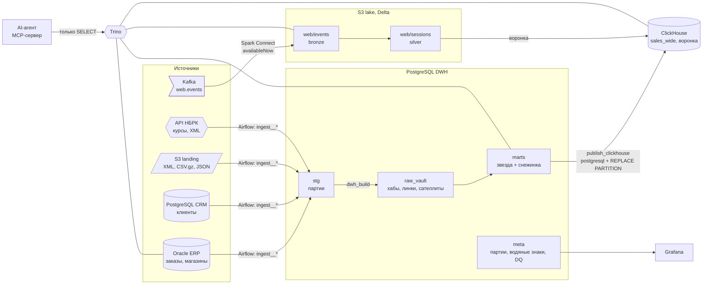

# Архитектура

## Слои

| Слой | Где | Что | Как обновляется |
|---|---|---|---|
| landing | S3 `landing/` | файлы как их прислали | внешние системы; после загрузки файл уходит в `archive/` |
| stg | PostgreSQL `stg.*` | строки источника, типизированные, с номером партии | append; раз в сутки удаляются партии старше 7 дней, уже разложенные по vault |
| raw_vault | PostgreSQL `raw_vault.*` | Data Vault 2.0: хабы, линки, сателлиты, справочники | только вставка; новая версия сателлита — если изменился hashdiff |
| marts | PostgreSQL `marts.*` | звезда: `fact_sales`, `fact_stock_daily`, измерения | инкрементально по `load_dts`, одна транзакция на сборку |
| ClickHouse | `retail.*` | плоская копия продаж, воронка сайта | помесячно, `REPLACE PARTITION` |
| lake | S3 `lake/delta/web/*` | кликстрим: bronze и silver | Spark, каждые 10 минут |

## Почему Data Vault между stg и звездой

Источников пять, и они меняются независимо: CRM переименует поле, у поставщика
появится новый атрибут, ERP начнёт переписывать заказы. В Data Vault:

- **новый источник — это добавление, а не переделка.** Пришёл остаток по
  магазинам — он цепляется к уже существующим хабам `store` и `product`;
- **история бесплатна и полна.** Сателлит хранит каждую версию, поэтому
  SCD2 в витрине — просто представление сателлита, а не отдельная логика;
- **загрузки не зависят друг от друга.** Заказ может прийти раньше клиента:
  хаб клиента создастся из заказа, атрибуты догонят позже. Звезда это
  отражает ключом -2 и потом перепривязывает (тест
  `test_late_arriving_customer_is_rekeyed`);
- **код не пишется руками.** DDL и загрузка генерируются из
  `models/vault.yml`: на 5 хабов, 3 линка (плюс неисторизуемый) и 9 сателлитов это 542 строки SQL,
  которые не надо поддерживать.

Цена — лишний слой и JOIN-ы при сборке звезды. Для пяти источников с
историей изменений она оправдана; для одного источника без истории Data
Vault был бы лишним.

## Звезда

- `fact_sales` — зерно «строка заказа», секционирование по месяцам
  (`date_key`), MERGE по изменённым заказам.
- `dim_customer` — SCD2, версия действует с момента изменения в CRM.
  Персональных данных нет, они в `raw_vault.sat_customer_pii`.
- `dim_product` → `dim_product_subcategory` → `dim_product_category` →
  `dim_product_group` — снежинка: иерархию правят отдельно от товаров.
  Для BI есть плоское `v_product`.
- `dim_store`, `dim_date` (праздники РК), `fact_stock_daily` (периодический
  снимок), `customer_rfm` (сегменты).

Маржа считается в тенге: закупочная цена поставщика в его валюте ×
официальный курс НБРК на дату заказа. Курс на выходные и праздники —
последний опубликованный.

## Оркестрация

- `ingest__<источник>` — генерируются фабрикой из `pipelines/*.yml`. Для
  файлов перед загрузкой стоит сенсор в режиме `reschedule`.
- `dwh_build` — запускается по Asset-ам stg-таблиц, а не по часам.
- `publish_clickhouse` — по Asset-у `marts.fact_sales`.
- `web_events` — каждые 10 минут: Kafka → Delta → сессии → ClickHouse.
- `stg_retention`, `simulate_sources` — обслуживание и стенд.

## Надёжность загрузки

- **Водяной знак с перекрытием.** ERP проставляет `updated_at` до коммита,
  и строка может стать видимой позже, чем её время. Поэтому окно
  перечитывает последние 60 минут. Дубли, которые это даёт, отсекаются в
  vault по hashdiff.
- **Партия атомарна.** Строки, запись в журнал и новый водяной знак
  фиксируются одной транзакцией.
- **Карантин.** Партия, не прошедшая проверку уровня `fail`, получает статус
  `rejected`, и vault её не берёт, пока человек не отпустит её командой
  `retail-dwh batch release <id>`.
- **Плохой файл не блокирует очередь.** Файл, который не разбирается, остаётся
  в landing, попадает в журнал как `failed`, а остальные файлы грузятся.
- **Один загрузчик за раз.** Advisory lock в PostgreSQL не даёт двум
  прогонам vault или сборки витрин наложиться.

## Мониторинг

Airflow шлёт StatsD в statsd-exporter. Задачи загрузки и проверок отправляют
свои метрики в Pushgateway: строки, длительность, время последнего успеха,
результат каждой проверки. Prometheus собирает всё это, правила алертов
лежат в `docker/monitoring/alerts.yml`. Свежесть данных проверяется
отдельно от «зелёности» DAG-а. Дашборд Grafana создаётся автоматически при
старте.
